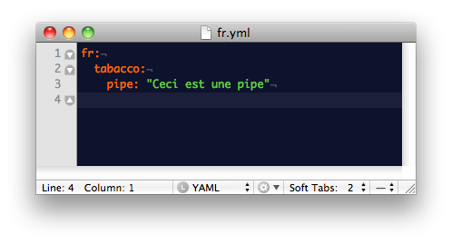

!SLIDE

# I18n

* Thibaut Assus, developer since 2007, notably with ruby + rails [http://github.com/tibastral](http://github.com/tibastral)
* French here with a business visa
* Working for my company in France named Milesrock, a development consulting
  company.
* I will talk about internationalization (i-18-n => i18n)

!SLIDE

## Why I18n ?

* Because english isn't everything for everyone !
* Some clients want i18n of their app (for example in Chinese)
* 2 subjects :
  * i18n of the app
  * i18n of the data

!SLIDE

## I18n of the app

!SLIDE

* Built-in in rails, the i18n of the app is really easy to implement!

  *Just create/edit the following files !*

<pre>
  /config/locales/[en,fr].yml
</pre>

* How many of you already use en.yml to edit activerecord error messages ?

!SLIDE

### It's YAML, so we know how it works

If I declare that "pipe" node in tabacco

I can use it by calling I18n.t("tabacco.pipe") or t("tabacco.pipe") or even t(".pipe"),
with the locale set to "fr" !

!SLIDE

### But how do we set the locale to "fr" ?

We just do the simple assignation I18n.locale = "fr"

### But in Rails, we like conventions, so we won't do that manually

!SLIDE
### To automatize, just 2 things to add, and your app is i18ned !

* set the locale based on the URL
* put the locale in *every* path you create !

!SLIDE

### 2 methods to add to Application controller

@@@ ruby
    class ApplicationController < ActionController::Base
        before_filter :set_locale
        (...)
        private
        def set_locale
            I18n.locale = params[:locale]
        end

        def default_url_options(options={})
            { :locale => I18n.locale }
        end
    end
@@@

<!-- detail the other possibilities here !  -->

!SLIDE

### So every time I want to internationalize something, I replace a text by t("a_text")
### and I add the translations in the .yml files for every language I want.

Easy, isn't it ?

!SLIDE

#Demo

!SLIDE

## I18n of data

!SLIDE

## What do I need ?

@@@ cucumber
Feature: i18n of the data
  In order to show some i18ned data
  As a programmer
  I want to have some columns of a model
  in a  different language
@@@

!SLIDE

I have to store all not i18ned elements in the table itself, and every other
element in another table, and reference everything from the root table...

# RHAAA !!

## But that's a pain in the ...

!SLIDE

## BUT

!SLIDE

### there is a gem for that =>

[Puret : https://github.com/jo/puret](https://github.com/jo/puret)

And it does everything for you (without being too intrusive of course)

!SLIDE

_models/post.rb_

@@@ ruby

class Post < ActiveRecord::Base
  puret :title, :description
end

@@@

_models/post\_translation.rb_

@@@ ruby
class PostTranslation < ActiveRecord::Base
  puret_for :post
end
@@@

_db/2011..post\_translations.rb_

@@@ ruby
create_table(:post_translations) do |t|
  t.references :post
  t.string :locale

  t.string :title
  t.text :description

  t.timestamps
end
add_index :post_translations, [:post_id, :locale], :unique => true
@@@

!SLIDE

which can be done by a generator ;)
@@@ bash
rails generate puret:model Post title:string description:text
@@@

or even
@@@ bash
rails generate puret:attribute Post body:text
@@@

_KISR : Keep it simple! Relax._
!SLIDE

As it's based on the locale, so when you go to

@@@ ruby
edit_post_path(@post, :locale => "fr")
@@@

you'll be able to edit your post in french (with the default language values)
and it'll be saved automatically to the internationalizing table !

### And that's it !

### Was it complicated ?

!SLIDE

# Bonus content !

!SLIDE

@@@ cucumber
Feature: research in my i18ned tables
  I want to search in my table with something like searchlogic
  But my elements aren't stored anymore in the table directly...
  And searchlogic isn't compatible with rails 3
  so it'll fail
@@@

!SLIDE

# BUT

!SLIDE

The [meta_search](https://github.com/ernie/meta_search) gem is here to help,

And I can reference my de-facto relations in my model to do the search

@@@ ruby

class Post < ActiveRecord::Base
  has\_many :post\_translations
  puret :title, :description
end

@@@

So I can do

@@@ ruby
  Post.search(:post\_translations\_title\_starts\_with => "hello")
@@@

!SLIDE

### So to be short, what to remember ?

* I18n is dead simple with rails 3
* Puret, and Meta Search are readable enough, not too magical and will save you a LOT of time in your next i18ned rails project !

!SLIDE

# Questions ?

!SLIDE

## Don't hesitate to email me for everything you didn't understand, I'm happy to help !

[tibastral@gmail.com](mailto:tibastral@gmail.com)

## If you want to use / fork these slides, help yourself :

[github.com/tibastral/i18n-pres](http://github.com/tibastral/i18n-pres)

!SLIDE

# Credits :

## Presentation done with :

[github.com/nakajima/slidedown](https://github.com/nakajima/slidedown)

Sassly hacked

## Content essentially from :

[Rails guides i18n](http://guides.rubyonrails.org/i18n.html)