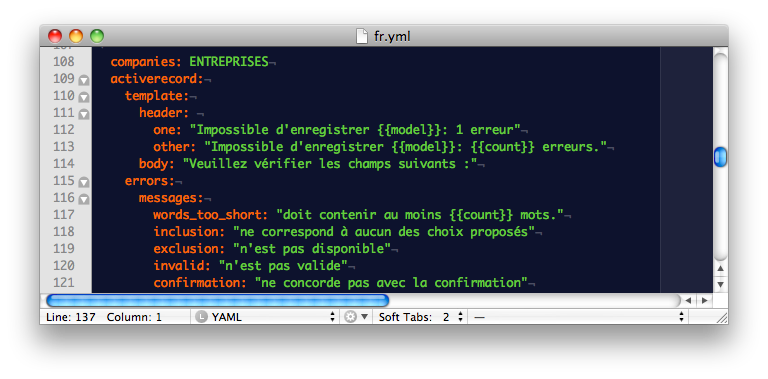

!SLIDE

# I18n

* Thibaut Assus, developer since 2007, notably with ruby + rails
* French here with a business visa
* Working for my company in France named Milesrock.
* I will talk about internationalization (i-18-n => i18n)

!SLIDE

* Because english isn't everything for everyone !
* Some clients want i18n of their app (for example in Chinese)
* 2 subjects :
  * i18n of the app
  * i18n of the data, which is more difficult

!SLIDE

## I18n of the app

!SLIDE

* Built-in in rails, the i18n of the app is really easy to implement !

  *Just edit the following files !*

<pre>
  /config/locales/[en,fr].yml
</pre>

* How many of you already use en.yml to edit activerecord error messages ?

!SLIDE

### It's YAML, so we know how it works

If I declare that test node in

@@@ yaml
  fr:
    company:
      test: My Test
@@@

I can use it by calling I18n.t("company.test") or t("company.test") or even t(".test"),
with the locale set to "fr" !

!SLIDE

### But how do we set the locale to "fr" ?

We just do I18n.locale = "fr"

### But in Rails, we like conventions, so we won't do that manually

!SLIDE
### For the rest, you only have 2 things to add to internationalize your app

* set the locale based on the URL
* put the locale in *every* path you create !

### 2 methods to add to Application controller

@@@ ruby
    class ApplicationController
        before_filter :set_locale
        (...)
        private
        def set_locale
            I18n.locale = params[:locale]
        end

        def default_url_options(options={})
            { :locale => I18n.locale }
        end
    end
@@@

!SLIDE

# Questions ?